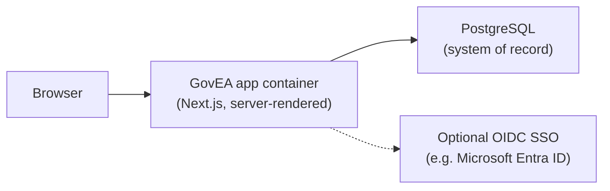

# GovEA

**Open source enterprise architecture for state and local government.**

GovEA helps government teams understand what they have, why it matters, and how technology connects to public outcomes. It is built around people, capabilities, applications, services, decisions, and strategy rather than compliance theater.

GovEA is free and open source. It can run locally, in containers, on-prem, or as a hosted deployment.

## What It Does

GovEA gives state and local government teams a practical EA workspace for:

- mapping personas, services, capabilities, applications, goals, objectives, and initiatives
- tracing mission needs to the systems that support them
- managing architecture decisions, principles, glossary terms, and architecture debt
- building stakeholder-friendly reports and roadmap views
- keeping taxonomy, audit, roles, and organization boundaries clear
- importing and exporting portfolio data as the product matures

The core traceability chain is:

```text
Goals -> Strategic Objectives -> Initiatives -> Capabilities -> Applications
```

For the full model, see [Data Model](./docs/data-model.md) and [Data and Traceability](./docs/architect/data-and-traceability.md).

## Who It Is For

GovEA is designed for public-sector teams that need useful enterprise architecture without heavyweight tooling overhead:

- enterprise architects and domain architects
- agency EA coordinators
- department leaders and business stakeholders
- budget, performance, and planning analysts
- data architects and application portfolio owners
- instance and organization administrators

Persona definitions live in [business-architecture/personas](./business-architecture/personas/). Persona journey findings live in [docs/persona-journeys](./docs/persona-journeys/).

## Where To Start

Different readers need different doors into this repository:

| If you are… | Start here |
|---|---|
| Evaluating GovEA for your agency | [What It Does](#what-it-does) above, then [Capabilities](./capabilities.md) for what is shipped today versus planned |
| An architect assessing the design | [Architecture at a Glance](#architecture-at-a-glance) below, then the [Architecture Overview](./docs/architect/README.md) |
| A practitioner asking "is this for people like me?" | [Personas](./business-architecture/personas/) and [persona journeys](./docs/persona-journeys/) |
| A security reviewer | [Security Policy](./SECURITY.md) and [Security and Tenancy](./docs/architect/security-and-tenancy.md) |
| A developer who wants to run it | [Quick Start](#quick-start) below |

## Current Shape

The product is in active development and is pre-1.0: evaluate freely, but treat any deployment as a development build until the [v0.9 Foundation Cleanup milestone](https://github.com/roballred/GovEA/milestone/1) completes. The shipped surface includes the core EA repository, traceability views, taxonomy, reporting, role-based access, audit, local/container development, and a growing set of import/export and admin capabilities.

For detail, use these source-of-truth documents:

| Topic | Details |
|---|---|
| Product capabilities and status | [capabilities.md](./capabilities.md) |
| Current priorities | [docs/product-priorities.md](./docs/product-priorities.md) |
| Product and delivery risks | [docs/risk-register.md](./docs/risk-register.md) |
| Architecture overview | [docs/architect/README.md](./docs/architect/README.md) |
| Runtime and deployment | [docs/architect/runtime-and-deployment.md](./docs/architect/runtime-and-deployment.md) |
| Security and tenancy | [docs/architect/security-and-tenancy.md](./docs/architect/security-and-tenancy.md) |
| Data model | [docs/data-model.md](./docs/data-model.md) |
| Standards for AI-assisted work | [Standards.md](./Standards.md) |

## Architecture at a Glance

GovEA is deliberately a simple system: one containerized web application in front of one PostgreSQL database. There is no microservice topology, no message bus, and no client-side data authority — that simplicity is a design decision, not an accident.



Three facts carry most of the design:

- **Multi-tenant by organization.** Every content record belongs to exactly one organization, users hold per-organization roles, and cross-organization sharing is explicit and approval-based. Details in [Security and Tenancy](./docs/architect/security-and-tenancy.md).
- **Audit-first.** Security-relevant mutations write to an audit log that is append-only at the database layer — even a compromised admin role cannot rewrite history.
- **Portable by design.** GovEA runs anywhere containers run — a laptop, an agency data center, or a government cloud. The application carries no cloud-specific assumptions. Details in [Runtime and Deployment](./docs/architect/runtime-and-deployment.md).

GovEA also separates its reusable platform machinery (identity, tenancy, RBAC, audit) from its enterprise-architecture domain. That platform layer is being extracted into [GovCore](https://github.com/roballred/GovCore), a separately versioned set of `@govcore/*` packages GovEA consumes as dependencies — so the same hardened multi-tenant foundation can support other government applications. See [Platform Foundation](./docs/architect/application-overview.md#platform-foundation-govcore).

The full architecture set lives in [docs/architect](./docs/architect/).

## Tech Stack

- **App:** Next.js App Router, React, TypeScript
- **Database:** PostgreSQL with Drizzle ORM
- **Auth:** Auth.js with local development auth and OIDC SSO architecture
- **Platform foundation:** [GovCore](https://github.com/roballred/GovCore) — the reusable multi-tenant platform (identity, tenancy, RBAC, audit) that GovEA is built on, consumed as `@govcore/*` packages
- **UI:** Tailwind CSS and shadcn/ui
- **Testing:** TypeScript, ESLint, Vitest integration tests, Playwright smoke tests
- **Deployment:** containerized app plus PostgreSQL

## Quick Start

Prerequisites:

- Node.js 20 or newer
- pnpm 9 or newer
- Docker or Podman for local database/container workflows

Clone and verify:

```bash
git clone https://github.com/roballred/GovEA.git
cd GovEA
pnpm verify
```

`pnpm verify` installs dependencies and runs the core local checks: type check, lint, and business-architecture docs lint.

Start a local demo database and app:

```bash
pnpm demo:start
```

Common local commands:

```bash
pnpm demo:db          # start Postgres only
pnpm demo:db:stop     # stop Postgres
pnpm demo:container   # run the full container stack
pnpm demo:stop        # stop the demo stack
```

For manual database work:

```bash
pnpm --filter govea db:migrate
pnpm --filter govea db:seed
pnpm --filter govea dev
```

## Development Workflow

GovEA follows the project standards in [Standards.md](./Standards.md):

- humans own direction, review, and merge decisions
- work starts from tracked issues
- capability and persona traceability matter
- all changes go through pull requests
- tests or explicit validation notes are expected for every change

Pull requests normally run:

- type check
- lint
- business-architecture docs lint
- production build
- integration tests
- Playwright smoke tests

## Architecture And Product Docs

Use the README as the starting point, not the full manual. Detailed material belongs in these docs:

- [Capabilities](./capabilities.md)
- [Architecture Overview](./docs/architect/README.md)
- [Application Overview](./docs/architect/application-overview.md)
- [Data and Traceability](./docs/architect/data-and-traceability.md)
- [Runtime and Deployment](./docs/architect/runtime-and-deployment.md)
- [Security and Tenancy](./docs/architect/security-and-tenancy.md)
- [Data Model](./docs/data-model.md)
- [Product Priorities](./docs/product-priorities.md)
- [Risk Register](./docs/risk-register.md)
- [Business Architecture Style Guide](./business-architecture/STYLE.md)

## Framework Alignment

GovEA is EasyEA-first. External frameworks such as TOGAF should support government teams without replacing the core workflow.

Framework support is taxonomy-and-recipe-backed ([ADR-0002: ADM as Classification](./docs/decisions/0002-adm-as-classification.md)): installing the TOGAF recipe gives an organization Architecture Domain and ADM Phase classifications, and the TOGAF reports read from that taxonomy — there is no hard-coded overlay. Current framework-alignment detail is tracked in [capabilities.md](./capabilities.md) and [ADR-0001: TOGAF and ADM Scope Boundary](./docs/decisions/0001-togaf-adm-scope.md).

## Deployment Notes

GovEA is container-friendly and designed to run against PostgreSQL. Local development can use Docker or Podman. Azure demo deployment helpers are present, but operator-specific Azure account configuration belongs in private operator environments, not this public repository.

See [Runtime and Deployment](./docs/architect/runtime-and-deployment.md) for architecture details and [Release Pipeline Policy](./docs/release-pipeline.md) for deployment privacy guidance.

## Security

Vulnerability reporting, scope, and the coordinated-disclosure policy are in [SECURITY.md](./SECURITY.md). The security architecture — identity, roles, tenant isolation, federation, and audit — is described in [Security and Tenancy](./docs/architect/security-and-tenancy.md).

## License

GovEA is released under the [MIT License](./LICENSE).
