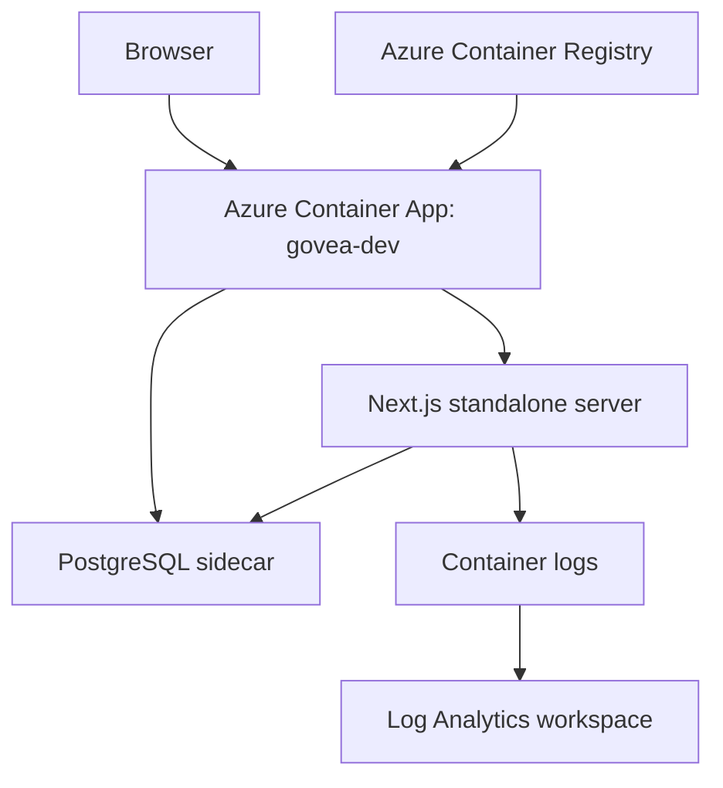
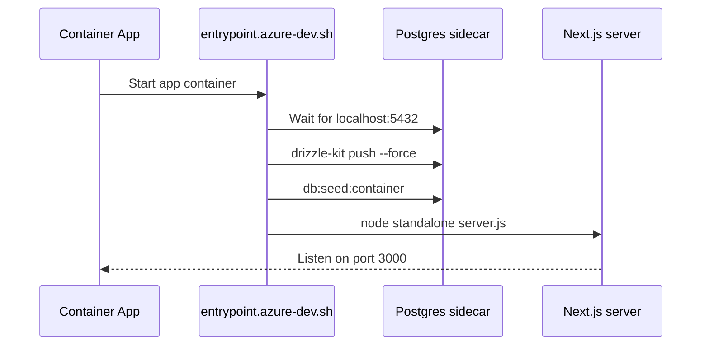

# Runtime and Deployment Architecture

GovEA is designed to run locally for development, in containers for self-hosted demos, and in Azure Container Apps for the shared demo environment.

## Runtime Components



The Azure demo currently uses a single Container App with:

- the GovEA app container
- a PostgreSQL sidecar reachable on `localhost:5432`
- production Next.js standalone runtime
- demo flags enabled through environment variables

## Local Development

Common local paths:

| Command | Purpose |
|---|---|
| `pnpm demo:start` | Start local app with containerized Postgres |
| `pnpm demo:db` | Start only the database |
| `pnpm demo:container` | Run the full container stack |
| `pnpm --filter govea dev` | Start the Next.js app after database setup |
| `pnpm --filter govea db:migrate` | Run local migrations |
| `pnpm --filter govea db:seed` | Load demo seed data |

Podman is preferred when available, but the compose helper can fall back to Docker.

## Azure Demo Deployment

The demo deployment script is `scripts/azure-dev.sh`.

| Command | Purpose |
|---|---|
| `bash scripts/azure-dev.sh deploy` | Create Azure resources and first deployment |
| `bash scripts/azure-dev.sh update` | Build a new image in ACR and roll out a new revision |
| `bash scripts/azure-dev.sh status` | Show current image and replica settings |
| `bash scripts/azure-dev.sh logs` | Stream app logs |
| `bash scripts/azure-dev.sh stop` | Scale to zero replicas |
| `bash scripts/azure-dev.sh start` | Restore one replica |

The update path builds remotely with `az acr build`, pushes a timestamped image tag, then updates the Container App image reference.

## Demo Runtime Environment

The demo should run as production Next.js with explicit demo behavior enabled:

| Variable | Expected demo value | Reason |
|---|---|---|
| `NODE_ENV` | `production` | Stable server-action bundles and standalone runtime |
| `DEMO_MODE` | `true` | Shows demo affordances such as login shortcuts |
| `DEV` | `true` | Enables seeded/demo behavior where still used |
| `AUTH_TRUST_HOST` | `true` | Allows Auth.js behind the Azure hostname |
| `NEXT_PUBLIC_APP_URL` | Demo URL | Used for auth and app URL generation |
| `AUTH_SECRET` | Stable secret | Keeps auth sessions stable across revisions |
| `DATABASE_URL` | Local sidecar URL | Points app to the Postgres sidecar |

Do not set the Azure demo back to `next dev` just to expose sample data. Demo data and shortcuts should be controlled through explicit demo flags while keeping the runtime production-like.

## Container Build Notes

The container files pin pnpm to the repository package-manager version before dependency installation. This matters because base images can ship a newer global pnpm that does not support the repo's Node version.

Build-sensitive files:

- `docker/Containerfile.dev`
- `docker/Containerfile`
- `docker/entrypoint.azure-dev.sh`
- `scripts/azure-dev.sh`
- `package.json`
- `pnpm-lock.yaml`

When changing package-manager, Node, or container base-image behavior, validate both CI and the Azure ACR build path. CI can pass while the Azure image build fails if the container base image has a different global toolchain.

## Startup Flow in Azure



The demo currently uses schema push plus idempotent seed data because it is a disposable demo environment. Persistent production tenants should move to explicit migrations and more conservative seed behavior.

## Operational Checks

After deployment, verify:

- Container App revision is healthy
- traffic is 100 percent on the new revision
- `/login` returns HTTP 200
- logs show schema sync, seed completion, and Next server ready
- no recurring auth, database pool, server-action, or static asset errors

Useful commands:

```bash
bash scripts/azure-dev.sh status
az containerapp revision list --name govea-dev --resource-group govea-dev-rg -o table
az containerapp logs show --name govea-dev --resource-group govea-dev-rg --tail 120
curl -I -L https://govea-dev.wittyocean-795e193a.eastus.azurecontainerapps.io/login
```

## Current Limitations

- There is not yet a traceable release pipeline from merge to deploy.
- The demo uses a sidecar Postgres instance, not a managed production database.
- Rollback is manual through Container Apps image/revision operations.
- The deployment script records image tags in output, but the repository does not yet persist a release record automatically.

Issue #504 tracks the release-pipeline work needed to make demo deployment traceable by commit, image digest, revision, smoke result, and rollback path.
