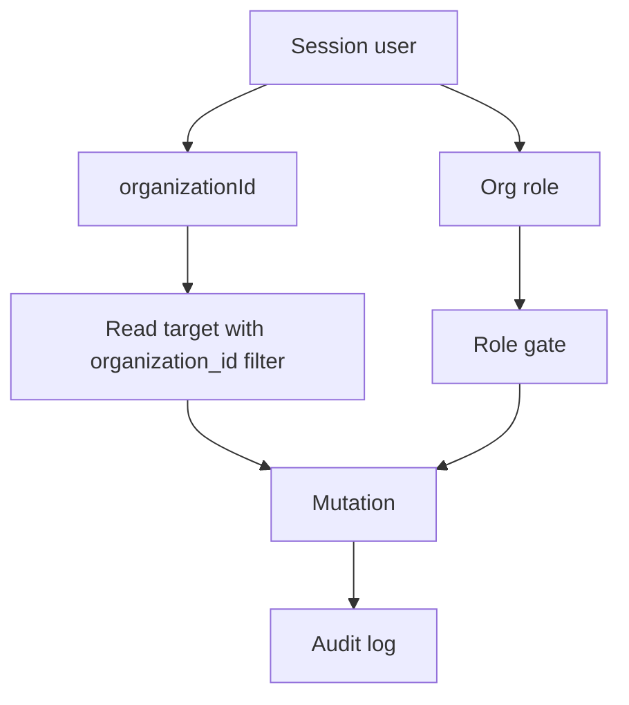

# Security and Tenancy Architecture

GovEA is multi-tenant at the application layer. The normal operating boundary is the organization. Users belong to one organization, content records carry `organization_id`, and cross-organization behavior is explicit rather than implicit.

## Identity Model

GovEA supports two sign-in paths:

| Sign-in path | Purpose | Notes |
|---|---|---|
| Local credentials | Development, fallback, and self-hosted operation | Password hashes are stored for local users |
| Microsoft Entra ID OIDC | Government SSO path | SSO users must be pre-provisioned before sign-in |

Auth is implemented with Auth.js in `apps/govea/src/lib/auth.ts`. Middleware uses the edge-safe Auth.js configuration from `apps/govea/src/middleware.ts` so route protection does not pull Node-only APIs into the Edge Runtime.

SSO does not auto-create usable tenant users. The sign-in callback checks that the external identity maps to a pre-provisioned, active user with an organization assignment. This keeps tenant access admin-managed.

## Roles

| Role | Scope | Intent |
|---|---|---|
| `admin` | Organization | Full tenant administration and content management |
| `contributor` | Organization | Create and edit EA content, without user management or destructive admin powers |
| `viewer` | Organization | Read viewer-visible published content |
| `instance_admin` | Instance | Platform operations across organizations through the instance console |

`instance_admin` is stored separately from the org-scoped role. It does not mean the user owns every organization's architecture content.

## Route Protection

Middleware handles coarse protection:

- public paths: `/login`, `/setup`, `/error`, `/api/auth`, `/maintenance`
- static assets are allowed
- unauthenticated users are redirected to `/login`
- maintenance mode redirects non-admin users to `/maintenance`
- `/instance` routes require `instance_admin`

This is only the outer gate. Server actions still need to enforce role, organization, and target-record rules.

## Tenant Boundary

Most business records include `organization_id`. Server actions should follow this pattern:

1. Read the current session.
2. Resolve the caller's organization and role from trusted session fields.
3. Load target records by both `id` and `organization_id`.
4. Reject cross-org writes unless a specific federation or support path allows them.
5. Write an audit event for security-relevant changes.

## Visibility and Federation

Content visibility is explicit:

| Visibility | Meaning |
|---|---|
| `org` | Visible only inside the owning organization |
| `connections` | Visible to directly connected organizations when federation rules allow it |
| `instance` | Visible across the GovEA instance where supported |

Federation uses:

- `org_connections` for explicit organization relationships
- `cross_org_links` for approved relationships between content objects
- read-only remote detail views for linked external content

Cross-org links must not become a back door around source visibility. Org-private source content should not be exposed through federation.

## Support Access

Instance support access is deliberately narrower than tenant administration.

| Mechanism | Purpose |
|---|---|
| Break-glass session | Time-bound, audited support access request for a target organization |
| Act-as session | Scoped support action path tied to an active break-glass parent |
| Instance audit log | Operator-visible record of platform and support actions |

Every cross-tenant support action should record the real actor, target tenant, reason/context, and support-session identifiers. A revoked or expired break-glass session must terminate dependent support behavior.

## Audit Requirements

Audit events are part of the security model, not just diagnostics. Mutations that affect identity, tenant status, support access, content visibility, relationships, or published architecture state should write audit records.

The audit log stores:

- actor user id when known
- organization id when applicable
- action name
- entity type and entity id
- before/after snapshots when useful
- metadata for support context, reasons, impersonated orgs, or request details

## Security Design Notes

- Never trust caller-supplied `organizationId` or `role` for authorization.
- Prefer server-side relationship checks over client-side hiding.
- Keep instance-admin features visibly separate from org-admin features.
- Treat federation as read/link coordination, not ownership transfer.
- Keep local auth available as an SSO fallback so administrators are not locked out when an identity provider is unavailable.
