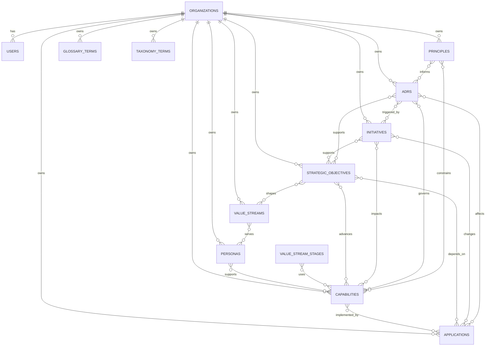

# GovEA Data Model Reference

This document describes the current implementation data model in `apps/govea/src/db/schema/`.

It is intentionally implementation-focused:
- what tables exist today
- what fields each table stores
- which fields are required, optional, or enum-backed
- how the major many-to-many relationships are modeled

For product intent, personas, and capability definitions, see `business-architecture/`.

## Design Conventions

Most content tables follow the same basic shape:

| Field pattern | Meaning |
|---|---|
| `id` | UUID primary key generated by the database |
| `organization_id` | Tenant boundary; almost all business data belongs to exactly one organization |
| `created_by`, `updated_by` | Optional FK to `users.id` for authorship tracking |
| `created_at`, `updated_at` | Timestamps for record lifecycle |
| `status` | Workflow or domain-specific status; some tables use shared workflow, others use a table-specific enum |
| `visibility` | Publication scope: `org`, `connections`, or `instance` |

Shared enum semantics:

| Enum | Values | Used by |
|---|---|---|
| `visibility` | `org`, `connections`, `instance` | Most publishable content |
| `workflow_status` | `draft`, `published`, `archived` | Personas, capabilities, applications, value streams, objectives, principles, glossary |
| `user_role` | `admin`, `contributor`, `viewer` | Users |

## Top-Level Model

## Core Tables

### `organizations`

Represents the tenant boundary for almost all business data.

| Field | Type | Required | Notes |
|---|---|---|---|
| `id` | UUID | Yes | Primary key |
| `name` | text | Yes | Display name |
| `slug` | text | Yes | Unique tenant slug |
| `theme` | text | Yes | Theme id; defaults to `govea` |
| `parent_id` | UUID | No | Self-reference for hierarchy; `SET NULL` on delete |
| `created_at` | timestamp | Yes | Defaults to `now()` |
| `updated_at` | timestamp | Yes | Defaults to `now()` |

### `users`

Authenticated users scoped to an organization.

| Field | Type | Required | Notes |
|---|---|---|---|
| `id` | UUID | Yes | Primary key |
| `organization_id` | UUID | Yes | FK to `organizations.id`; cascade delete |
| `name` | text | No | Display name |
| `email` | text | Yes | Unique within an organization |
| `email_verified` | timestamp | No | Auth.js-compatible email verification field |
| `image` | text | No | Profile image URL |
| `password_hash` | text | No | Present for local auth users |
| `role` | `user_role` enum | Yes | Defaults to `viewer` |
| `is_active` | text | Yes | Stored as text; defaults to `'true'` |
| `created_at` | timestamp | Yes | Defaults to `now()` |
| `updated_at` | timestamp | Yes | Defaults to `now()` |

Additional Auth.js support tables:
- `accounts`: external provider account bindings
- `sessions`: persisted login sessions
- `verification_tokens`: email/token verification records

### `persona_types`

Org-scoped controlled vocabulary for persona categories.

| Field | Type | Required | Notes |
|---|---|---|---|
| `id` | UUID | Yes | Primary key |
| `organization_id` | UUID | Yes | FK to organization |
| `name` | text | Yes | Unique per organization |
| `created_at` | timestamp | Yes | Defaults to `now()` |

### `tags`

Org-scoped tag vocabulary used for personas.

| Field | Type | Required | Notes |
|---|---|---|---|
| `id` | UUID | Yes | Primary key |
| `organization_id` | UUID | Yes | FK to organization |
| `name` | text | Yes | Unique per organization |
| `created_at` | timestamp | Yes | Defaults to `now()` |

### `personas`

People-centered anchor objects representing who the organization serves.

| Field | Type | Required | Notes |
|---|---|---|---|
| `id` | UUID | Yes | Primary key |
| `organization_id` | UUID | Yes | FK to organization |
| `name` | text | Yes | Persona label |
| `description` | text | No | Narrative description |
| `type` | text | No | Current selected persona type label |
| `status` | `workflow_status` enum | Yes | Defaults to `draft` |
| `visibility` | `visibility` enum | Yes | Defaults to `org` |
| `created_by` | UUID | No | FK to user |
| `updated_by` | UUID | No | FK to user |
| `created_at` | timestamp | Yes | Defaults to `now()` |
| `updated_at` | timestamp | Yes | Defaults to `now()` |

Related tables:
- `persona_tags`: join table between personas and tags

### `capabilities`

Business capabilities linked to personas and applications.

| Field | Type | Required | Notes |
|---|---|---|---|
| `id` | UUID | Yes | Primary key |
| `organization_id` | UUID | Yes | FK to organization |
| `name` | text | Yes | Capability name |
| `description` | text | No | Summary text |
| `domain` | text | No | Top-level domain grouping |
| `behaviors` | text | No | One behavior per line; stored as newline-delimited text |
| `rules` | text | No | Constraints/invariants; stored as newline-delimited text |
| `status` | `workflow_status` enum | Yes | Defaults to `draft` |
| `visibility` | `visibility` enum | Yes | Defaults to `org` |
| `created_by` | UUID | No | FK to user |
| `updated_by` | UUID | No | FK to user |
| `created_at` | timestamp | Yes | Defaults to `now()` |
| `updated_at` | timestamp | Yes | Defaults to `now()` |

Related tables:
- `capability_personas`: join table between capabilities and personas

### `applications`

Technology/application portfolio records.

| Field | Type | Required | Notes |
|---|---|---|---|
| `id` | UUID | Yes | Primary key |
| `organization_id` | UUID | Yes | FK to organization |
| `name` | text | Yes | Application name |
| `description` | text | No | Summary text |
| `vendor` | text | No | Vendor or provider |
| `version` | text | No | Version string |
| `hosting_model` | text | No | Free-text values like `on-prem`, `saas`, `hybrid` |
| `lifecycle_status` | enum | Yes | `active`, `sunset`, `decommissioned`, `planned` |
| `status` | `workflow_status` enum | Yes | Defaults to `draft` |
| `visibility` | `visibility` enum | Yes | Defaults to `org` |
| `created_by` | UUID | No | FK to user |
| `updated_by` | UUID | No | FK to user |
| `created_at` | timestamp | Yes | Defaults to `now()` |
| `updated_at` | timestamp | Yes | Defaults to `now()` |

Related tables:
- `application_capabilities`: join table between applications and capabilities

Implementation rule:
- every application is expected to link to at least one capability at the application layer

### `adrs`

Architecture Decision Records.

| Field | Type | Required | Notes |
|---|---|---|---|
| `id` | UUID | Yes | Primary key |
| `organization_id` | UUID | Yes | FK to organization |
| `number` | text | Yes | Display identifier like `ADR-001` |
| `title` | text | Yes | Decision title |
| `context` | text | No | Problem/context section |
| `decision` | text | No | Decision section |
| `consequences` | text | No | Consequences section |
| `status` | `adr_status` enum | Yes | `proposed`, `accepted`, `deprecated`, `superseded` |
| `visibility` | `visibility` enum | Yes | Defaults to `org` |
| `superseded_by` | UUID | No | Self-reference to another ADR; `SET NULL` on delete |
| `created_by` | UUID | No | FK to user |
| `updated_by` | UUID | No | FK to user |
| `created_at` | timestamp | Yes | Defaults to `now()` |
| `updated_at` | timestamp | Yes | Defaults to `now()` |

Related tables:
- `adr_capabilities`
- `adr_applications`
- `adr_initiatives`
- `adr_objectives`

### `value_streams`

End-to-end value delivery flows with ordered stages.

| Field | Type | Required | Notes |
|---|---|---|---|
| `id` | UUID | Yes | Primary key |
| `organization_id` | UUID | Yes | FK to organization |
| `name` | text | Yes | Value stream name |
| `description` | text | No | Summary text |
| `value_item` | text | No | What is delivered to the stakeholder |
| `status` | `workflow_status` enum | Yes | Defaults to `draft` |
| `visibility` | `visibility` enum | Yes | Defaults to `org` |
| `created_by` | UUID | No | FK to user |
| `updated_by` | UUID | No | FK to user |
| `created_at` | timestamp | Yes | Defaults to `now()` |
| `updated_at` | timestamp | Yes | Defaults to `now()` |

Child and related tables:
- `value_stream_stages`: ordered stages within a value stream
- `value_stream_stage_capabilities`: capabilities linked to a stage
- `value_stream_personas`: personas served by the value stream

### `strategic_objectives`

Strategy records linked to capabilities, applications, and value streams.

| Field | Type | Required | Notes |
|---|---|---|---|
| `id` | UUID | Yes | Primary key |
| `organization_id` | UUID | Yes | FK to organization |
| `name` | text | Yes | Objective name |
| `description` | text | No | Summary text |
| `success_metric` | text | No | How achievement is measured |
| `time_horizon` | text | No | Free text such as `FY2026` or `3-year` |
| `status` | `workflow_status` enum | Yes | Defaults to `draft` |
| `visibility` | `visibility` enum | Yes | Defaults to `org` |
| `created_by` | UUID | No | FK to user |
| `updated_by` | UUID | No | FK to user |
| `created_at` | timestamp | Yes | Defaults to `now()` |
| `updated_at` | timestamp | Yes | Defaults to `now()` |

Related tables:
- `objective_capabilities`
- `objective_value_streams`
- `objective_applications`

### `initiatives`

Change initiatives with planning-specific status and impact labels.

| Field | Type | Required | Notes |
|---|---|---|---|
| `id` | UUID | Yes | Primary key |
| `organization_id` | UUID | Yes | FK to organization |
| `name` | text | Yes | Initiative name |
| `description` | text | No | Summary text |
| `status` | `initiative_status` enum | Yes | `proposed`, `active`, `on-hold`, `complete`, `cancelled` |
| `start_date` | text | No | Free-text planning date, not a native SQL date |
| `end_date` | text | No | Free-text planning date |
| `visibility` | `visibility` enum | Yes | Defaults to `org` |
| `created_by` | UUID | No | FK to user |
| `updated_by` | UUID | No | FK to user |
| `created_at` | timestamp | Yes | Defaults to `now()` |
| `updated_at` | timestamp | Yes | Defaults to `now()` |

Related tables:
- `initiative_capabilities`: includes optional `impact`
- `initiative_objectives`
- `initiative_applications`: includes optional `impact`

Impact metadata:
- capability impact is stored as free text and currently used for values like `build`, `improve`, `retire`
- application impact is stored as free text and currently used for values like `build`, `improve`, `retire`, `migrate`

### `principles`

Architecture principles linked to capabilities and ADRs.

| Field | Type | Required | Notes |
|---|---|---|---|
| `id` | UUID | Yes | Primary key |
| `organization_id` | UUID | Yes | FK to organization |
| `name` | text | Yes | Short display label |
| `description` | text | No | One-sentence summary |
| `title` | text | No | Full principle statement |
| `rationale` | text | No | Why the principle exists |
| `implications` | text | No | Operational implications |
| `status` | `workflow_status` enum | Yes | Defaults to `draft` |
| `visibility` | `visibility` enum | Yes | Defaults to `org` |
| `created_by` | UUID | No | FK to user |
| `updated_by` | UUID | No | FK to user |
| `created_at` | timestamp | Yes | Defaults to `now()` |
| `updated_at` | timestamp | Yes | Defaults to `now()` |

Related tables:
- `principle_adrs`
- `principle_capabilities`

### `glossary_terms`

Shared terminology records with optional source attribution.

| Field | Type | Required | Notes |
|---|---|---|---|
| `id` | UUID | Yes | Primary key |
| `organization_id` | UUID | Yes | FK to organization |
| `term` | text | Yes | The glossary term |
| `definition` | text | Yes | Active definition text |
| `definition_source` | text | No | Name of the selected source |
| `definition_source_url` | text | No | URL for the selected source |
| `domain` | text | No | Domain grouping |
| `notes` | text | No | Editorial notes |
| `status` | `workflow_status` enum | Yes | Defaults to `draft` |
| `visibility` | `visibility` enum | Yes | Defaults to `org` |
| `created_by` | UUID | No | FK to user |
| `updated_by` | UUID | No | FK to user |
| `created_at` | timestamp | Yes | Defaults to `now()` |
| `updated_at` | timestamp | Yes | Defaults to `now()` |

Related table:
- `glossary_term_sources`: authoritative source definitions attached to a term

### `taxonomy_terms`

Org-scoped taxonomy hierarchy used for controlled vocabularies.

| Field | Type | Required | Notes |
|---|---|---|---|
| `id` | UUID | Yes | Primary key |
| `organization_id` | UUID | Yes | FK to organization |
| `parent_id` | UUID | No | Hierarchy parent; stored without explicit FK in this schema file |
| `name` | text | Yes | Term label |
| `slug` | text | Yes | Slugified value |
| `description` | text | No | Explanatory text |
| `domain` | text | No | Top-level domain grouping |
| `sort_order` | text | No | Ordering hint stored as text |
| `created_at` | timestamp | Yes | Defaults to `now()` |
| `updated_at` | timestamp | Yes | Defaults to `now()` |

## Federation and Visibility Tables

### `org_connections`

Explicit bilateral organization connections required for `connections`-scope sharing.

| Field | Type | Required | Notes |
|---|---|---|---|
| `id` | UUID | Yes | Primary key |
| `from_org_id` | UUID | Yes | Source organization |
| `to_org_id` | UUID | Yes | Target organization |
| `status` | `connection_status` enum | Yes | `pending`, `active`, `rejected` |
| `created_by` | UUID | No | FK to user |
| `created_at` | timestamp | Yes | Defaults to `now()` |
| `updated_at` | timestamp | Yes | Defaults to `now()` |

Constraint:
- unique on `(from_org_id, to_org_id)`

### `cross_org_links`

Cross-org relationships between content items. These intentionally avoid FKs on source/target entity ids because they may point across organizations and entity tables.

| Field | Type | Required | Notes |
|---|---|---|---|
| `id` | UUID | Yes | Primary key |
| `source_org_id` | UUID | Yes | Owning org of the source entity |
| `source_entity_type` | text | Yes | Currently documented for capability/persona use |
| `source_entity_id` | UUID | Yes | Source record id |
| `target_org_id` | UUID | Yes | Owning org of the target entity |
| `target_entity_type` | text | Yes | Currently documented for capability/persona use |
| `target_entity_id` | UUID | Yes | Target record id |
| `link_type` | `link_type` enum | Yes | `implements`, `extends`, `maps_to` |
| `status` | `link_status` enum | Yes | `pending`, `active`, `rejected` |
| `rejection_reason` | text | No | Reason for rejection |
| `created_by` | UUID | No | FK to user |
| `created_at` | timestamp | Yes | Defaults to `now()` |
| `updated_at` | timestamp | Yes | Defaults to `now()` |

## Audit Table

### `audit_log`

Immutable event log for content and security-relevant actions.

| Field | Type | Required | Notes |
|---|---|---|---|
| `id` | UUID | Yes | Primary key |
| `organization_id` | UUID | No | Set null if org is deleted |
| `user_id` | UUID | No | Set null if user is deleted |
| `action` | text | Yes | Event name like `create`, `update`, `delete`, `login` |
| `entity_type` | text | Yes | Entity category such as `persona` or `application` |
| `entity_id` | UUID | No | Changed record id |
| `before` | JSONB | No | Snapshot before change |
| `after` | JSONB | No | Snapshot after change |
| `metadata` | JSONB | No | Auxiliary metadata such as IP or user agent |
| `created_at` | timestamp | Yes | Defaults to `now()` |

## Junction Table Summary

GovEA uses explicit many-to-many join tables rather than arrays or JSON relationships.

| Table | Connects | Extra metadata |
|---|---|---|
| `persona_tags` | personas ↔ tags | None |
| `capability_personas` | capabilities ↔ personas | None |
| `application_capabilities` | applications ↔ capabilities | None |
| `value_stream_personas` | value streams ↔ personas | None |
| `value_stream_stage_capabilities` | value stream stages ↔ capabilities | None |
| `objective_capabilities` | objectives ↔ capabilities | None |
| `objective_value_streams` | objectives ↔ value streams | None |
| `objective_applications` | objectives ↔ applications | None |
| `initiative_capabilities` | initiatives ↔ capabilities | `impact` |
| `initiative_objectives` | initiatives ↔ objectives | None |
| `initiative_applications` | initiatives ↔ applications | `impact` |
| `adr_capabilities` | ADRs ↔ capabilities | None |
| `adr_applications` | ADRs ↔ applications | None |
| `adr_initiatives` | ADRs ↔ initiatives | None |
| `adr_objectives` | ADRs ↔ objectives | None |
| `principle_adrs` | principles ↔ ADRs | None |
| `principle_capabilities` | principles ↔ capabilities | None |

## Field Metadata Notes

These details matter when writing migrations, actions, tests, or exports:

1. `visibility` is a publication scope, not an authorization role. Access still depends on application logic and federation state.
2. `status` is not uniform across all tables. Most content uses `workflow_status`, but initiatives and ADRs have their own enums.
3. Several planning and display fields are stored as free text instead of stricter types:
   - `initiatives.start_date`
   - `initiatives.end_date`
   - `strategic_objectives.time_horizon`
   - `applications.hosting_model`
4. `capabilities.behaviors` and `capabilities.rules` are stored as newline-delimited text rather than structured child records.
5. `taxonomy_terms.parent_id` is hierarchical metadata, but it is not declared with an explicit FK in the schema file.
6. `users.is_active` is currently stored as text with values like `'true'`, not a native boolean column.
7. `cross_org_links` intentionally avoids direct FKs to business entity tables because those links cross tenant boundaries and are enforced in application code.
8. `audit_log.before`, `audit_log.after`, and `audit_log.metadata` are JSONB and should be treated as schemaless event payloads.

## Source of Truth

If this document and the code ever disagree, the schema files in `apps/govea/src/db/schema/` win. This file is a maintained reference, not a replacement for the schema.
